# 📦 Week 5: Azure Data Factory Customer Pipeline Project

This project was completed during my internship at **Celebal Technologies Pvt. Ltd.**. It demonstrates how to build a simple data pipeline using **Azure Data Factory (ADF)** that extracts data from an Azure SQL Database and stores it in Azure Blob Storage in `.csv` format.

---

## 🧰 Tech Stack

- **Azure Data Factory**
- **Azure SQL Database**
- **Azure Blob Storage**
- **Microsoft Azure Portal**
- **Git & GitHub**

---

## 🎯 Project Objective

To build an ETL pipeline that:
- Extracts customer data from an Azure SQL Database
- Loads the data into Azure Blob Storage in CSV format
- Uses linked services and datasets within ADF
- Allows monitoring and debugging through ADF interface

---

## 📁 Folder Structure

```
azure-datafactory-customer-pipeline/
├── DS_SourceCustomers_support_live/
├── DS_SinkCustomersCSV_support_live/
├── PL_CopyCustomers_support_live/
├── Screenshots/
├── customers.csv
└── README.md
```

---

## 🧱 Step-by-Step Process (with Screenshots)

### 🔹 1. Azure SQL Database Setup

Created a database and uploaded the sample data.

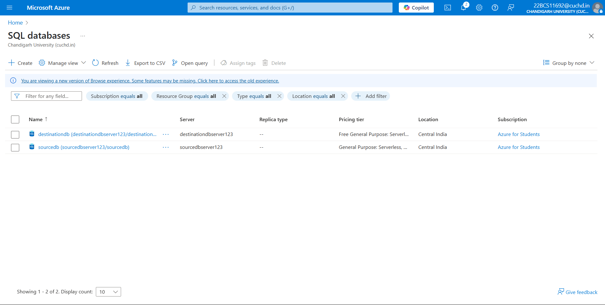

---

### 🔹 2. Created Azure Data Factory Instance

Created a new ADF instance using Azure Portal.

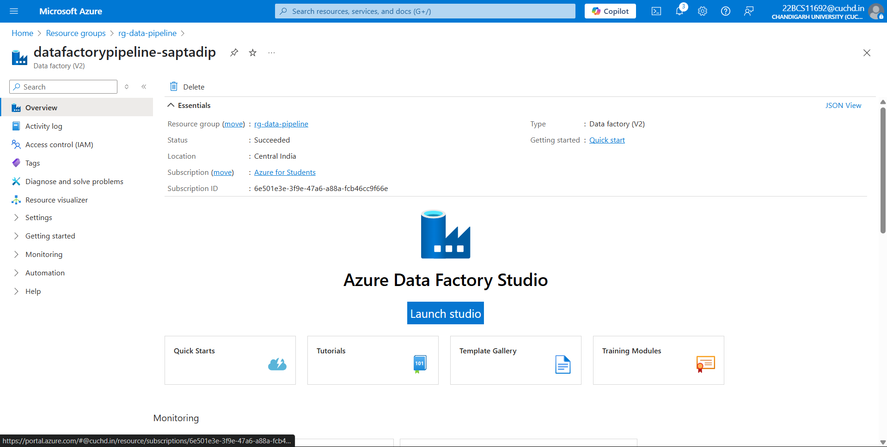

---

### 🔹 3. Created Linked Services

Configured connections to:
- Azure SQL DB
- Azure Blob Storage

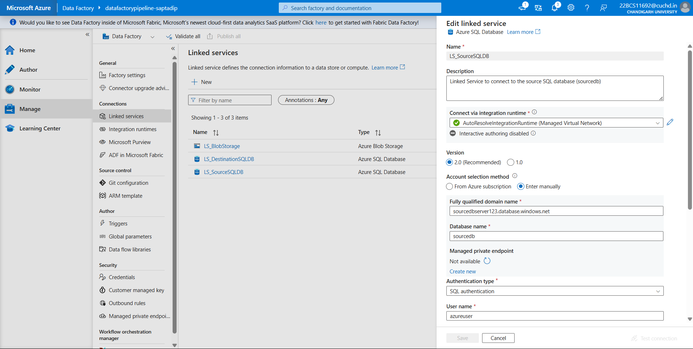  
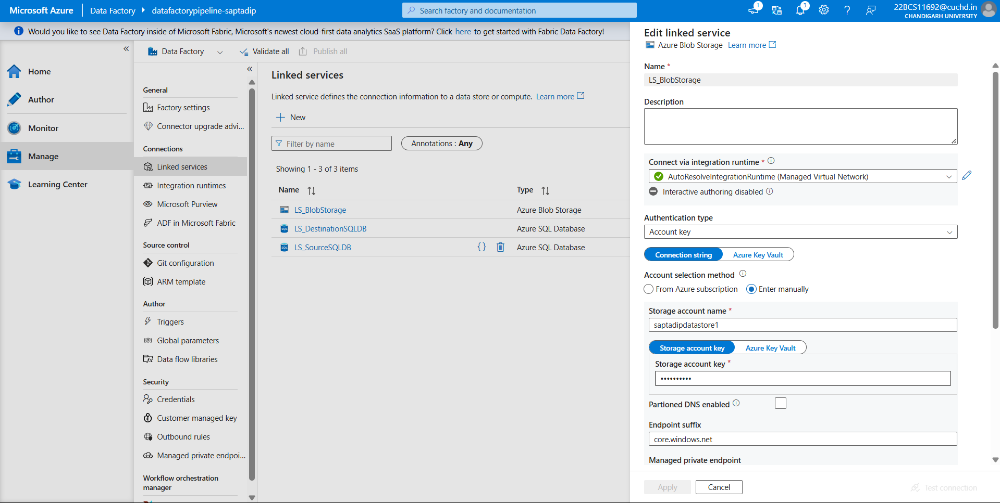

---

### 🔹 4. Defined Datasets

- **Source Dataset** points to the customer table in SQL  
  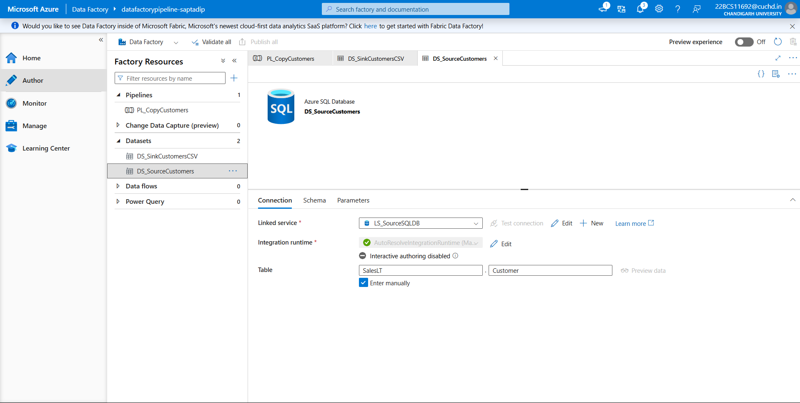

- **Sink Dataset** points to the blob container for CSV  
  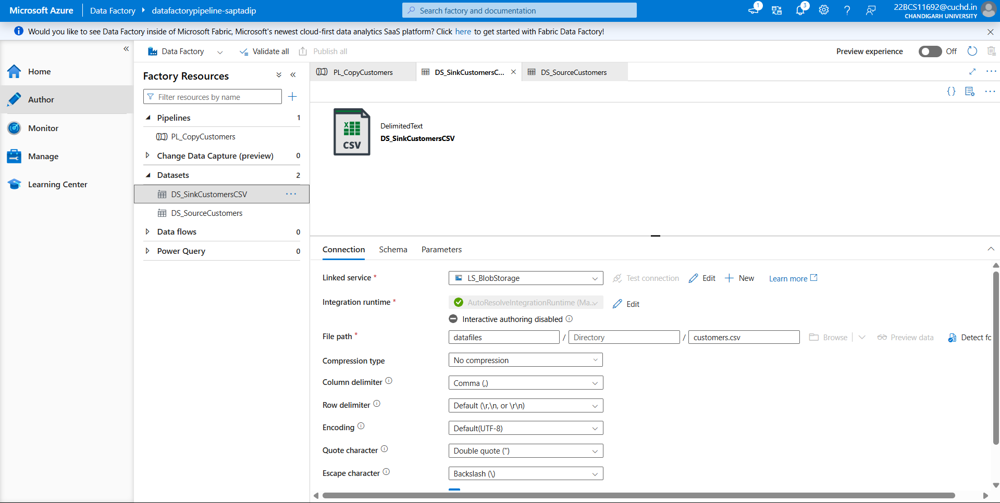

---

### 🔹 5. Configured Copy Activity

Set up data mapping between source and sink.

- Source Configuration  
  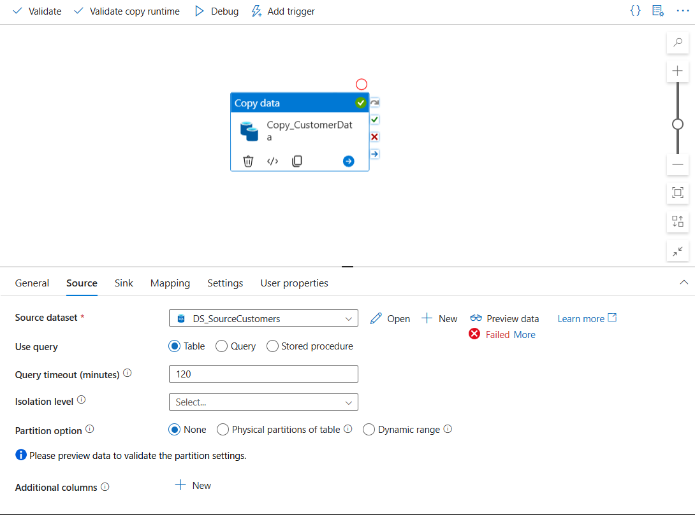

- Sink Configuration  
  

---

### 🔹 6. Designed Pipeline

Created a pipeline with the configured Copy activity.

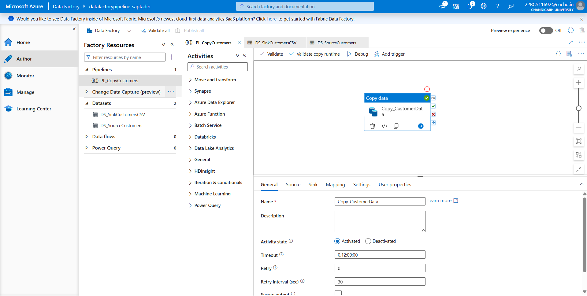

---

### 🔹 7. Debug & Run Pipeline

Executed the pipeline using the Debug option.

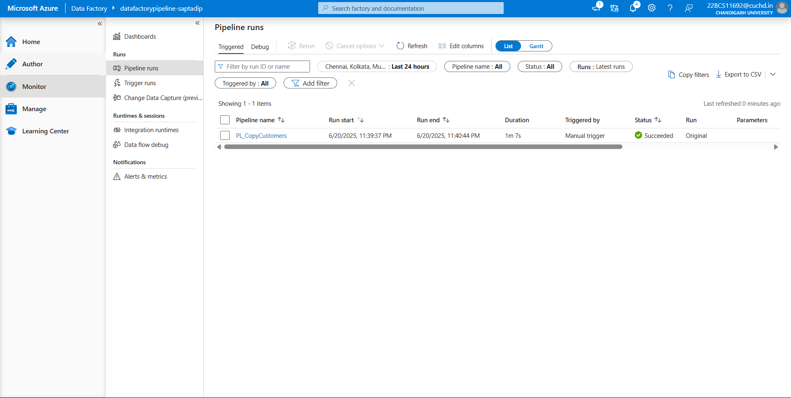

---

### 🔹 8. Output Verification

Verified the output in Azure Blob Storage.

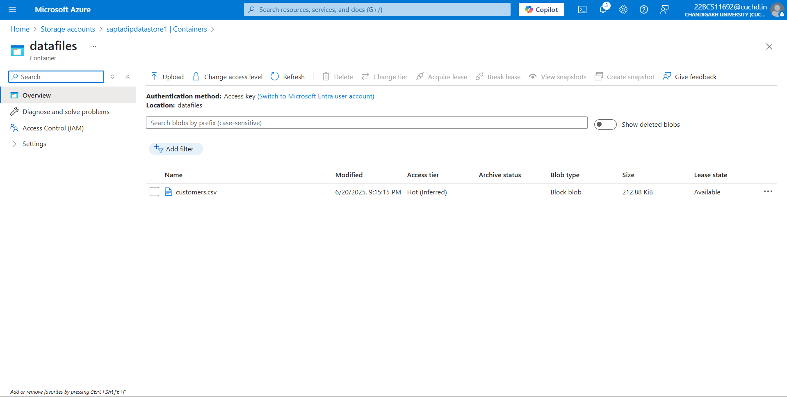

---

### 🔹 9. Support Files

Exported ADF components as JSON files for reuse.

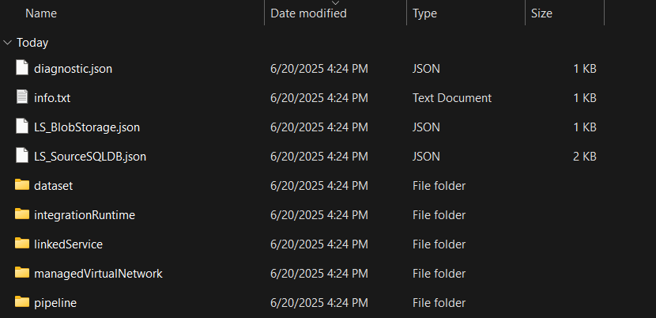

---

## ⚙️ Files Included

- `customers-100.csv`: Sample data file
- `*.json`: Exported datasets, pipelines, and linked services
- `Screenshots/`: Visual walkthrough of the implementation

---

## 💡 Challenges Faced

- Faced a **database inconsistency issue** where one operation was failing while two others succeeded — eventually resolved by **recreating the database**.
- During authentication, my **IP address was blocked**, which I had to manually enable under firewall settings.
- Encountered a **pipeline connectivity issue**, which required multiple rounds of debugging to fix and ensure all services were properly connected.

---

## 🚀 How to Run

1. Clone this repository
2. Upload `customers.csv` to your Azure SQL DB
3. Import JSON files into your Azure Data Factory instance
4. Recreate linked services with your own credentials
5. Run the pipeline from ADF interface

---

## 🙌 Acknowledgements

Big thanks to the mentors at **Celebal Technologies**:
- Himanshi Khandelwal
- Sharthak Acharjee
- Prerna Kamat
- Priyanshi Jain
- Akash Aggarwal

Project implemented and documented by **Saptadip**, as part of the Data Engineering Internship at Celebal Technologies Pvt. Ltd.

---

📌 *Project built with guidance during my Data Engineering Internship at Celebal Technologies Pvt. Ltd.*
