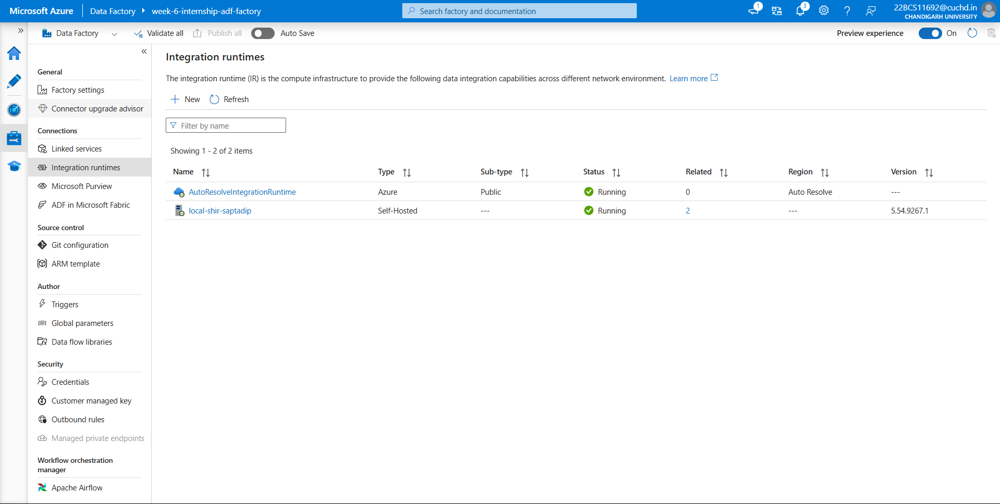
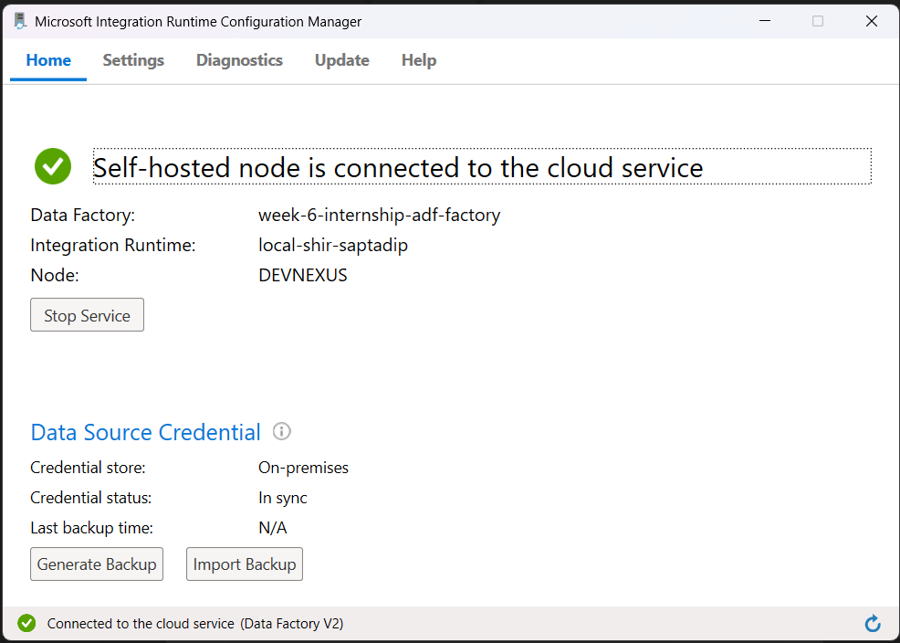
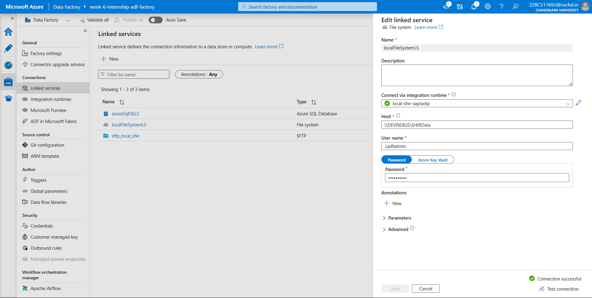
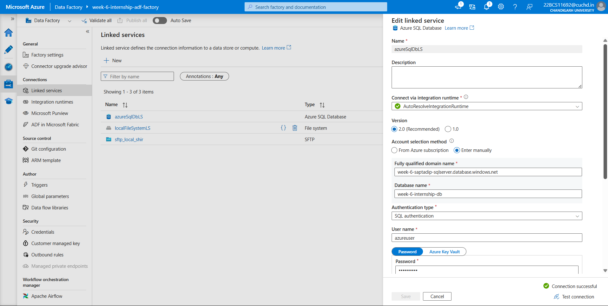
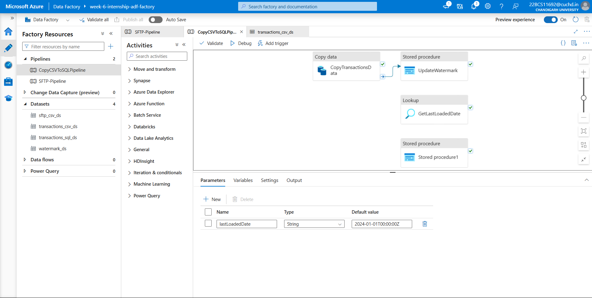
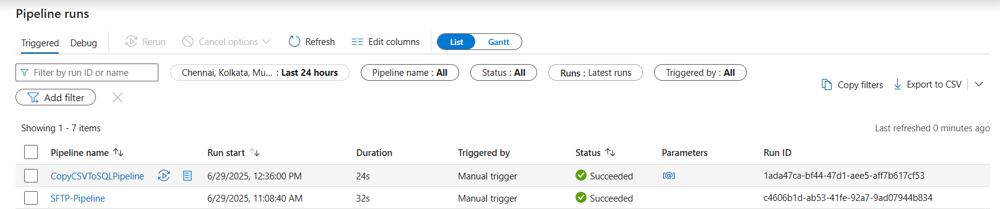

# 🚀 Problem 01: SHIR - Local System to Azure SQL Database

This module demonstrates how I used **Azure Data Factory** to copy data securely from a local server (on-premises) to an **Azure SQL Database** using **Self-hosted Integration Runtime (SHIR)**. This is the first milestone in building a robust data ingestion pipeline from local environments to the cloud.

---

## 🧠 Problem Statement

> **Configure Self-hosted Integration Runtime to Extract Data from Local Server and Load into Azure SQL Database:**  
Set up a Self-hosted Integration Runtime (SHIR) in Azure Data Factory to securely connect to an on-premises server. Extract data from the local environment and load it into an Azure SQL Database to enable cloud-based analytics and processing.

---

## 🛠️ Key Components Used

- **Azure Data Factory**
- **Self-hosted Integration Runtime (SHIR)**
- **Azure SQL Database**
- **Local CSV File**
- **Copy Activity in ADF Pipeline**

---

## 🧱 Implementation Steps

### ✅ Step 1: SHIR Setup

Installed SHIR on my local machine and linked it with Azure Data Factory.

📸 

📸 

---

### ✅ Step 2: Linked Services Configuration

- **Local File System Linked Service:** Points to a shared folder `\\DEVNEXUS\SHIRData` from which the data is extracted.

📸   
🔗 [View JSON Config](./localFileSystemLS.json)

- **Azure SQL Linked Service:** Securely connects to Azure SQL DB using SQL Authentication.

📸 

---

### ✅ Step 3: Copy Activity Pipeline

A simple pipeline named **CopyCSVToSQLPipeline** was created to copy data from a CSV file to a SQL table.

📸   
📝 [View Pipeline JSON](./CopyCSVToSQLPipeline.json)

---

### ✅ Step 4: Execution & Monitoring

Executed the pipeline and verified a successful data transfer.

📸 

---

## 📦 Folder Contents

| File | Description |
|------|-------------|
| `shir-setup-start.png` | Initial setup of SHIR on Azure |
| `shir-installed-and-connected.png` | Screenshot after SHIR is installed and connected |
| `local-filesystem-linked-service.png` | Linked service for local file system |
| `localFileSystemLS.json` | JSON definition of the local file system linked service |
| `azure-sql-linked-service.png` | Linked service config for Azure SQL |
| `copy-from-local-to-sql.png` | Copy activity configuration screenshot |
| `CopyCSVToSQLPipeline.json` | JSON definition of the ADF pipeline |
| `shir-pipeline-success.png` | Successful run of the SHIR copy pipeline |

---

## 🧩 Challenges Faced

- ❗ **SHIR Connection Issues**: Faced logon failure due to incorrect user permissions. Solved by recreating a new local user with proper shared folder access.
- ❗ **Network Path Issues**: Ensured correct shared folder path (`\\DEVNEXUS\SHIRData`) and proper firewall access.
- ❗ **CSV Formatting**: Ensured the file had headers and used UTF-8 encoding for correct parsing.

---

## ✅ Outcome

- Local data was securely and successfully transferred to Azure SQL Database.
- Self-hosted Integration Runtime is now a powerful tool in my ADF skillset.

---

> _This marks the completion of Problem Statement 01 from the Celebal Internship Week 6 assignment._

---
