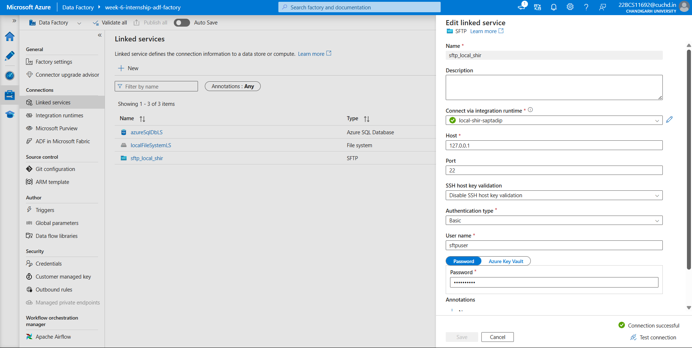
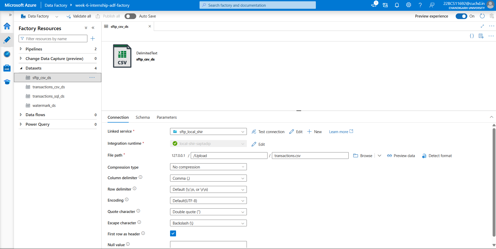
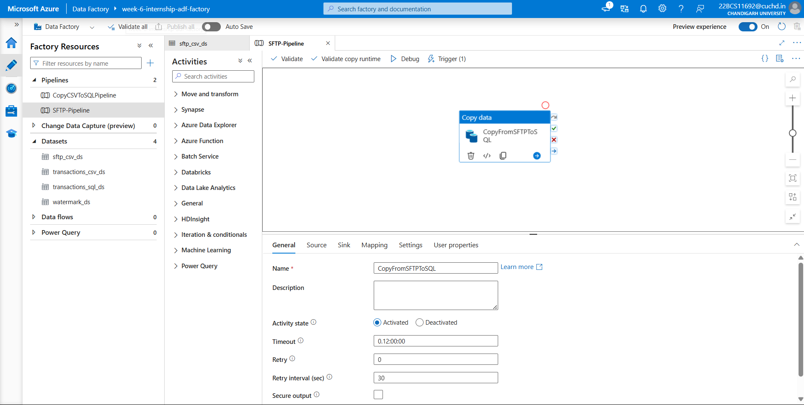
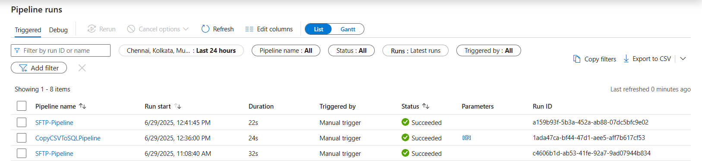

# 🌐 Problem 02: SFTP Data Extraction Pipeline

This module shows how I extracted data from an **SFTP server** and ingested it into **Azure SQL Database** using **Azure Data Factory (ADF)** and **Self-hosted Integration Runtime (SHIR)**. This demonstrates how to integrate external systems like FTP/SFTP securely into the Azure ecosystem.

---

## 📌 Problem Statement

> **Configure FTP/SFTP Server and Create an ADF Pipeline for Data Extraction:**  
Set up access to FTP/SFTP servers and build a pipeline in Azure Data Factory to extract files or datasets from these sources. This facilitates integration with external systems or partners.

---

## 🛠️ Components Used

- **Azure Data Factory**
- **SFTP Server**
- **Self-hosted Integration Runtime**
- **Azure SQL Database**
- **Copy Activity Pipeline**

---

## 🔧 Implementation Steps

### ✅ Step 1: Setup SFTP Server Locally

I configured an SFTP server locally to simulate a real-world data extraction source.

📸 

---

### ✅ Step 2: Linked Services Setup

- **SFTP Linked Service**: Created using SHIR to securely access files from the SFTP server.

📸   
🔗 [View JSON Config](./sftp_local_shir.json)

- **Azure SQL Linked Service**: Reused from Problem 01.

---

### ✅ Step 3: Dataset Configuration

Created a dataset that reads a `.csv` file (like `transactions.csv`) from the `/upload` directory in the SFTP server.

📸 

---

### ✅ Step 4: Create Copy Activity Pipeline

A pipeline was built to copy the uploaded CSV data from the SFTP location to the Azure SQL table.

📸   
📝 [View Pipeline JSON](./SFTP-Pipeline.json)

---

### ✅ Step 5: Execution & Monitoring

Ran the pipeline successfully after uploading `transactions.csv` using **FileZilla** to the `/upload` folder.

📸 

---

## 📦 Folder Contents

| File | Description |
|------|-------------|
| `sftp-setver-running.png` | Screenshot of the local SFTP server running |
| `sftp-linked-service.png` | Linked service created for SFTP |
| `sftp_local_shir.json` | JSON config of the SFTP linked service |
| `sftp-dataset.png` | Dataset configuration for reading CSV from SFTP |
| `sftp-to-sql-copy-activity.png` | Copy activity setup from SFTP to SQL |
| `SFTP-Pipeline.json` | ADF pipeline JSON |
| `sftp-pipeline-success.png` | Pipeline run succeeded screenshot |

---

## 💡 Challenges & Solutions

- ❗ **Blocked FileZilla Download**: Microsoft Defender flagged FileZilla, but I proceeded safely by allowing the download manually.
- ❗ **File Path Issues**: Initially used the wrong path in the dataset; fixed by correctly specifying `/upload/transactions.csv`.
- ❗ **Firewall Restrictions**: Faced SQL connectivity issues due to IP not being whitelisted. Solved by adding the SHIR outbound IP to the Azure SQL firewall rules.

---

## ✅ Outcome

- Securely fetched data from a local SFTP server.
- Successfully loaded it into Azure SQL using SHIR-enabled pipelines.
- Learned hands-on integration of external systems with Azure.

---

> _This completes Problem Statement 02 of the Celebal Internship Week 6 assignment._

---
