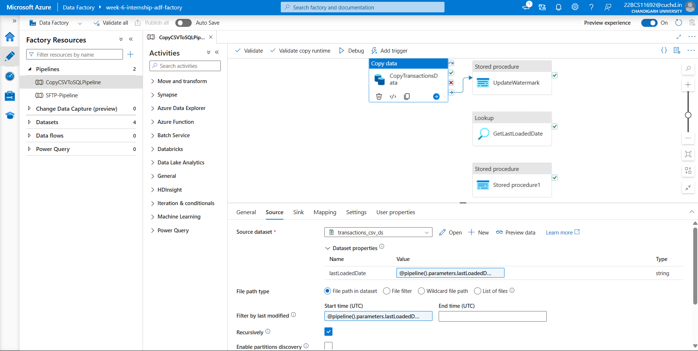

# 🔁 Problem 03: Incremental Load with Daily Automation

This module showcases how I implemented **Incremental Data Loading** in Azure Data Factory using **watermarking**, and how I automated the pipeline to run on a **daily basis**.

---

## 📌 Problem Statement

> **Create Incremental Load Pipeline and Automate This on a Daily Basis:**  
Design an ADF pipeline to perform incremental data loads using techniques like watermarking or change tracking. Schedule this pipeline to run daily to ensure only new or modified records are processed, optimizing performance and reducing load.

---

## 🛠️ Components Used

- **Azure Data Factory**
- **Watermark Table for Last Loaded Date**
- **Stored Procedure for Merge Logic**
- **SQL Server Dataset**
- **Daily Trigger**

---

## 🔧 Implementation Steps

### ✅ Step 1: Watermark Table & Stored Procedure Setup

Two essential database components were created:

- **watermark_table** to keep track of the last loaded date.
- **usp_MergeTransactions** stored procedure to perform upserts based on new data.

📎 Files:
- [watermark table.csv](./watermark%20table.csv)
- [usp_MergeTransactions.csv](./usp_MergeTransactions.csv)

---

### ✅ Step 2: Copy Activity with Watermark

The pipeline uses a **Lookup** activity to read the `last_loaded_date` from `watermark_table`, and passes it to a **Copy Activity** that filters only new data.

📸 

---

### ✅ Step 3: Pipeline Flow

Below is the visual flow of the incremental pipeline:

📸 

Activities included:
- `GetLastLoadedDate` (Lookup)
- `CopyTransactionsData` (Copy Activity with filter)
- `StoredProcedure` (Merge logic)
- `UpdateWatermark` (Final watermark update)

📝 [View Pipeline JSON](./Pipeline.json)

---

### ✅ Step 4: Daily Trigger Setup

Configured a **time-based trigger** to run the pipeline once every day.

📸 

---

## 📦 Folder Contents

| File | Description |
|------|-------------|
| `copy-activity-with-watermark.png` | Shows Copy Activity using a watermark |
| `daily-trigger-setup.png` | Daily trigger configuration screenshot |
| `incremental-pipeline-flow.png` | Visual overview of the full pipeline |
| `Pipeline.json` | JSON export of the pipeline |
| `usp_MergeTransactions.csv` | Stored procedure logic (as CSV) |
| `watermark table.csv` | Sample content of the watermark table |

---

## 💡 Challenges & Solutions

- ❗ **Parameter Binding Errors**: Faced issues with the `lastLoadedDate` parameter not being passed. Fixed by assigning it explicitly in the pipeline parameters and mapping it properly.
- ❗ **Watermark Mismatch**: Ensured all date formats matched correctly between source CSV and SQL table.
- ❗ **Trigger Not Executing**: Resolved by publishing pipeline and linking trigger correctly after configuration.

---

## ✅ Outcome

- Pipeline now supports **incremental data ingestion**, drastically improving performance.
- Scheduled automation ensures timely updates to the database without manual intervention.

---

> _This concludes Problem Statement 03 of the Celebal Internship Week 6 assignment._

---
