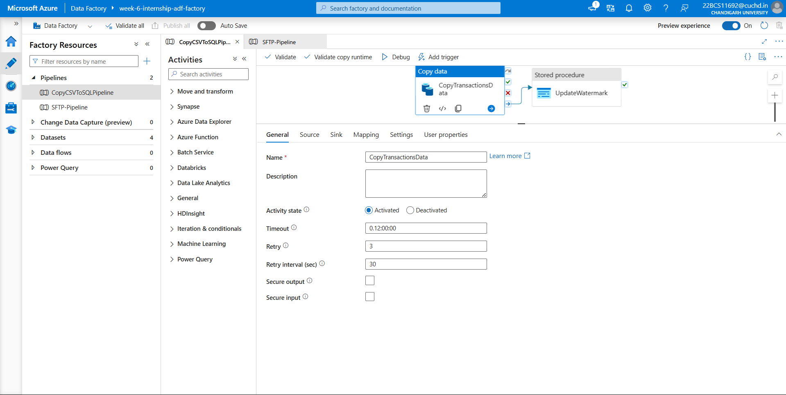

# 🔁 Problem 05: Retry Logic and Fail-Safe Mechanism in Azure Data Factory

This module explains how I implemented **retry logic and fail-safe configuration** in Azure Data Factory to gracefully handle transient data retrieval failures like timeouts, disconnections, or temporary unavailability of resources.

---

## 📌 Problem Statement

> **Retrieving data. Wait a few seconds and try to cut or copy again:**  
Implement logic to handle data retrieval failures gracefully by waiting briefly (e.g., a few seconds) before retrying cut, copy, or extraction operations, improving pipeline resilience and reducing transient error impacts.

---

## 🛠️ Components Used

- **Azure Data Factory (ADF)**
- **Copy Activity**
- **Retry Policies**
- **Timeouts and Fault Tolerance**

---

## 🔧 Implementation Steps

### ✅ Step 1: Configure Retry Settings

In each activity, I configured:
- **Retry Count**: `3`
- **Retry Interval (in seconds)**: `30`
- **Timeout**: Default of 12 hours (can be adjusted per activity)

This ensures the activity **automatically retries up to 3 times** in case of failure, with a 60-second delay between each attempt.

📸 

---

### ✅ Step 2: Update All Critical Activities

I applied the retry configuration to the following activities:
- `GetLastLoadedDate` (Lookup)
- `CopyTransactionsData` (Copy Activity)
- `StoredProcedure` (Merge Logic)
- `UpdateWatermark`

📝 [View Pipeline JSON](./Pipeline.json)

---

## 💡 Challenges & Solutions

| Challenge | Solution |
|----------|----------|
| Retry interval too low (`10s`) caused validation errors | Set it to valid range (min `30s`) |
| No retry settings applied initially | Added retry logic to all critical activities |
| Failures due to SQL lock or network lag | Handled with automated retry and back-off |

---

## ✅ Outcome

- Pipeline now automatically **recovers from temporary failures**.
- Retry logic ensures **no manual intervention is required** for minor glitches.
- Improved overall pipeline **stability and reliability**.

---

## 📦 Folder Contents

| File | Description |
|------|-------------|
| `retry-settings-copy-activity.png` | Screenshot showing retry settings on Copy Activity |
| `Pipeline.json` | Pipeline export with retry logic |
| `README.md` | This documentation file |

---

> _This completes Problem Statement 05 of the Celebal Internship Week 6 assignment._

---
