# 📊 Azure Data Factory Project – Week 7 (Celebal Internship)

Welcome to my **Week 7 Assignment** during my internship at **Celebal Technologies**.  
This project uses **Azure Data Factory** to load and transform multiple CSV files from Azure Blob Storage into Azure SQL Database using **3 separate static pipelines**.

---

## 📁 Repository Structure

```
Celebal-Internship-Assignments/
└── Week 7/
    ├── json/
    │   ├── pipelines/
    │   ├── datasets/
    │   └── linkedservices/
    ├── CSV Datasets/
    │   ├── CUST_MSTR Files/
    │   ├── master_child_export Files/
    │   └── H_ECOM_ORDER File/
    ├── screenshots/
    ├── pipeline-diagrams/
    └── README.md
```

---

## ✅ Objective

We are given **3 types of CSV files** stored in a Data Lake (Blob Storage), and the goal is to:

1. Load each file into a **separate SQL table**
2. Perform basic transformation (add extra date columns from filenames)
3. Build **independent, static pipelines** for each file type
4. Ensure the pipelines can run separately and **succeed without interfering** with each other

---

## 📦 File Types and Logic

| File Type | Transformation | Target Table |
|-----------|----------------|--------------|
| `CUST_MSTR_YYYYMMDD.csv` | Add column: `LoadDate` (from filename) | `CUST_MSTR` |
| `master_child_export-YYYYMMDD.csv` | Add columns: `Date` & `DateKey` (from filename) | `master_child_export_static` |
| `H_ECOM_ORDER.csv` | No transformation | `H_ECOM_Orders_static` |

---

## 🚀 Pipelines Created

| Pipeline Name | JSON File |
|---------------|------------|
| `saptadip_pl_cust_mstr_load` | [`saptadip_pl_cust_mstr_load.json`](./json/pipelines/saptadip_pl_cust_mstr_load.json) |
| `saptadip_pl_master_child_load` | [`saptadip_pl_master_child_load.json`](./json/pipelines/saptadip_pl_master_child_load.json) |
| `saptadip_pl_h_ecom_order_load` | [`saptadip_pl_h_ecom_order_load.json`](./json/pipelines/saptadip_pl_h_ecom_order_load.json) |

📌 These are **static pipelines** created for specific file names and structure (no parameters).

---

## 📂 Sample CSV Files Used

All source CSV files used in this project are included in the repository for reference and testing:

| File Type | Folder | Sample Filename |
|-----------|--------|------------------|
| CUST_MSTR | `CSV Datasets/CUST_MSTR Files/` | `CUST_MSTR_20191112.csv` |
| master_child_export | `CSV Datasets/master_child_export Files/` | `master_child_export-20191112.csv` |
| H_ECOM_ORDER | `CSV Datasets/H_ECOM_ORDER File/` | `H_ECOM_ORDER.csv` |

These files were manually uploaded to the Blob container (`rawdata`) in Azure for the demo pipelines.

---

## 🧩 JSON Files Included

### 🔗 Linked Services
- [ls_blob_saptadip.json](./json/linkedservices/ls_blob_saptadip.json)
- [ls_sql_saptadip.json](./json/linkedservices/ls_sql_saptadip.json)

### 📂 Datasets
- **Blob Input Datasets:**
  - [ds_cust_mstr_input.json](./json/datasets/ds_cust_mstr_input.json)
  - [ds_master_child_input.json](./json/datasets/ds_master_child_input.json)
  - [ds_h_ecom_order_input.json](./json/datasets/ds_h_ecom_order_input.json)
- **SQL Output Datasets:**
  - [ds_cust_mstr_output.json](./json/datasets/ds_cust_mstr_output.json)
  - [ds_master_child_output.json](./json/datasets/ds_master_child_output.json)
  - [ds_h_ecom_order_output.json](./json/datasets/ds_h_ecom_order_output.json)

---

## 🖼️ Step-by-Step Screenshots

### 📌 SQL Database & Table Creation

| Description | Screenshot |
|------------|------------|
| Create SQL DB | 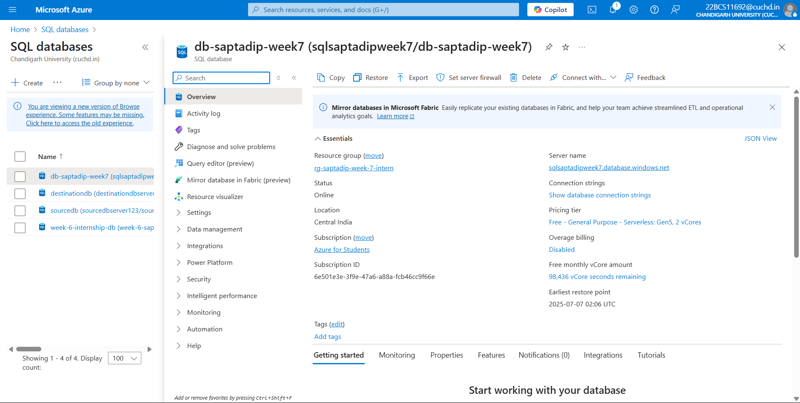 |
| Table: `CUST_MSTR` | 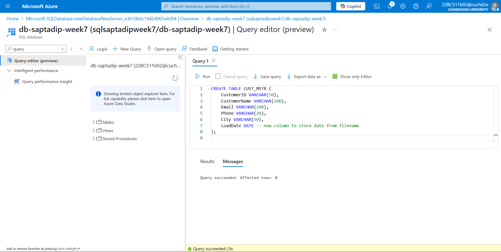 |
| Table: `master_child_export_static` | 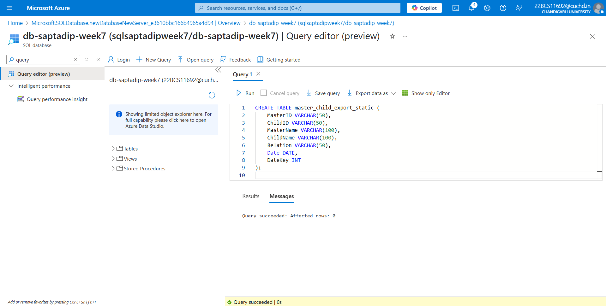 |
| Table: `H_ECOM_Orders_static` |  |

---

### 🔗 Linked Services

| Description | Screenshot |
|------------|------------|
| Blob Storage | 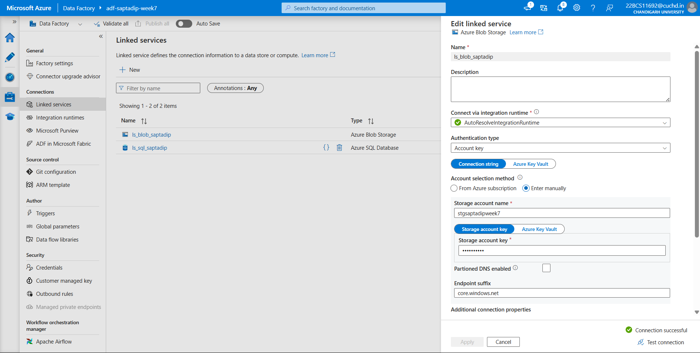 |
| Azure SQL DB | 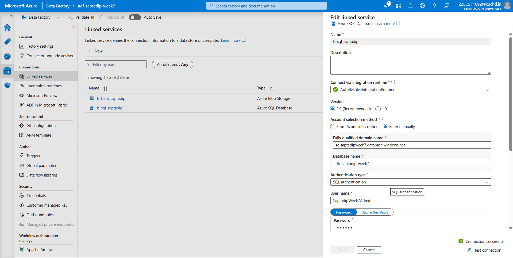 |

---

### 📂 Datasets (Author > Dataset)

| Dataset | Screenshot |
|--------|------------|
| Input: CUST_MSTR (Blob) | 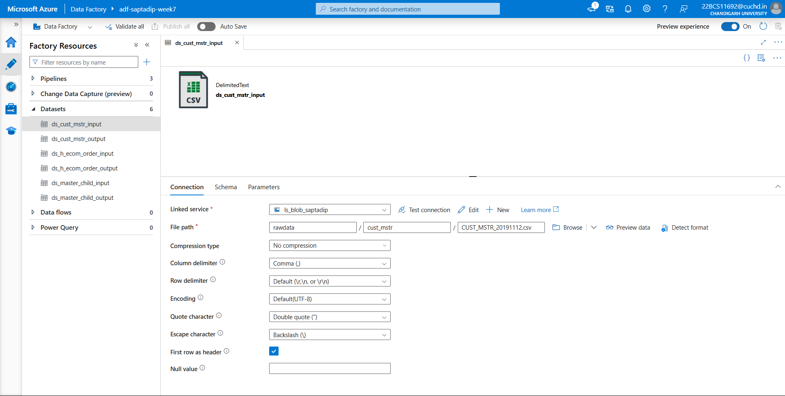 |
| Output: CUST_MSTR (SQL) | 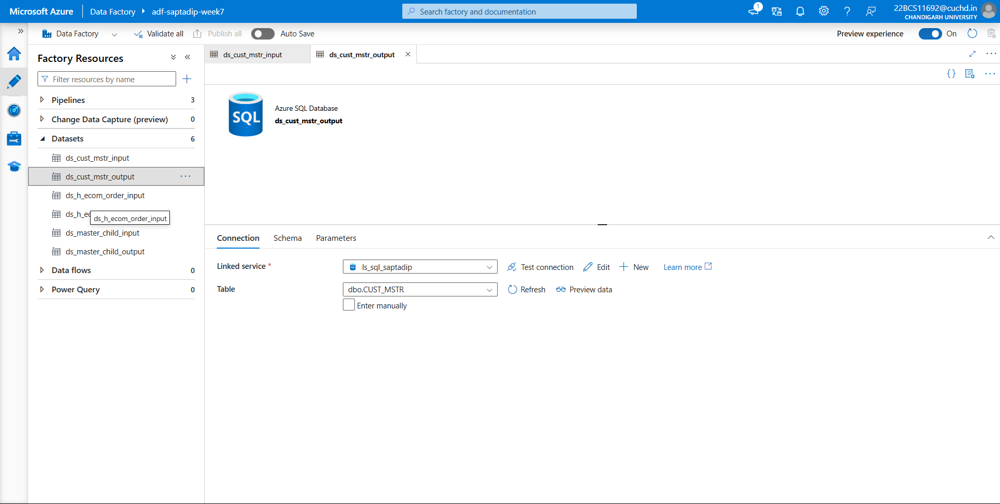 |
| Input: master_child_export (Blob) | 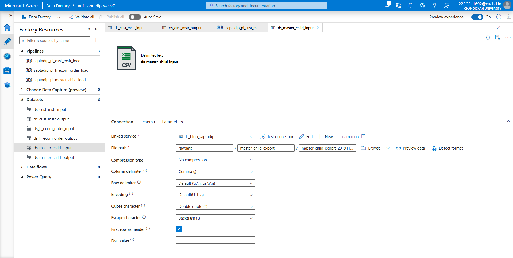 |
| Output: master_child_export (SQL) | 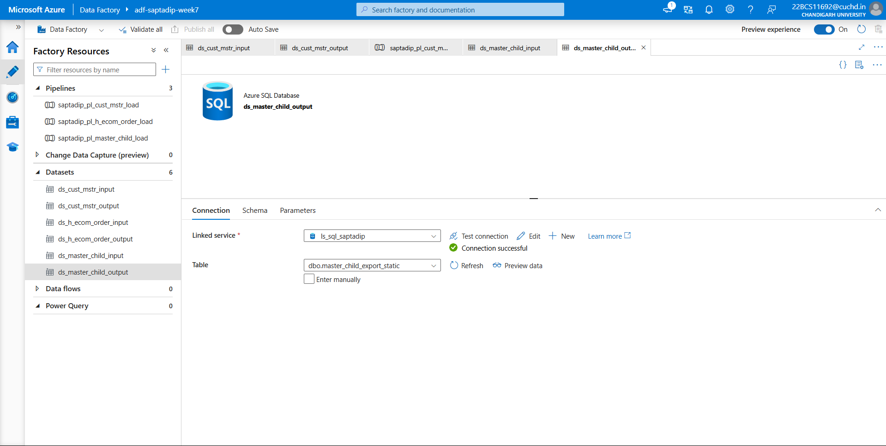 |
| Input: H_ECOM_ORDER (Blob) | 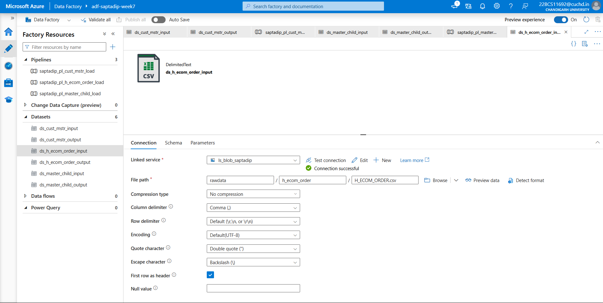 |
| Output: H_ECOM_ORDER (SQL) | 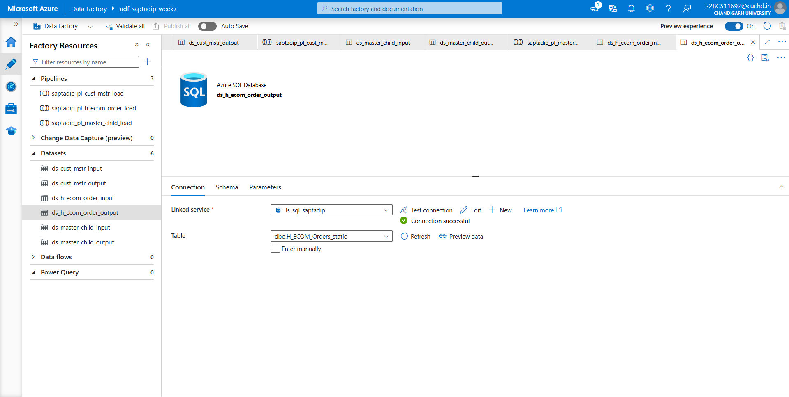 |

---

### 🔄 Copy Activity Mapping (Inside Pipelines)

| Pipeline | Mapping Screenshot |
|-------------|------------|
| CUST_MSTR | 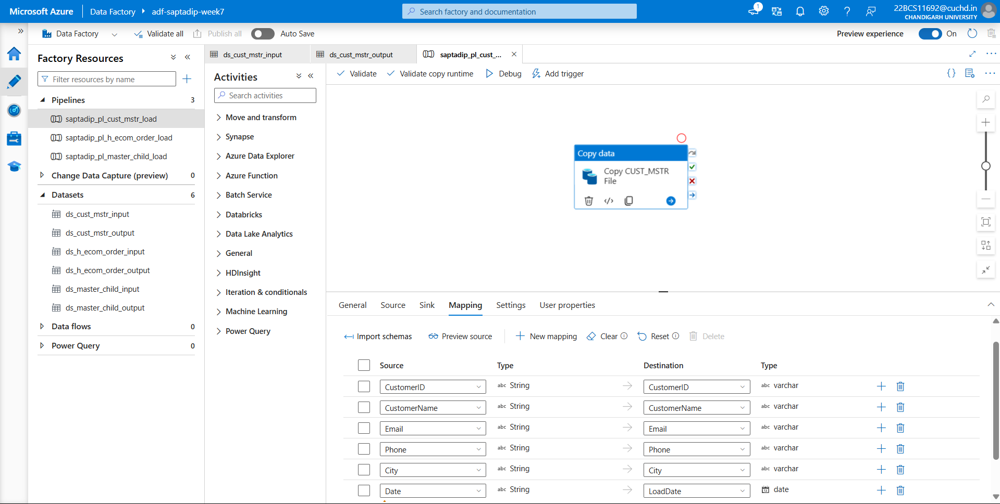 |
| master_child_export |  |
| H_ECOM_ORDER | 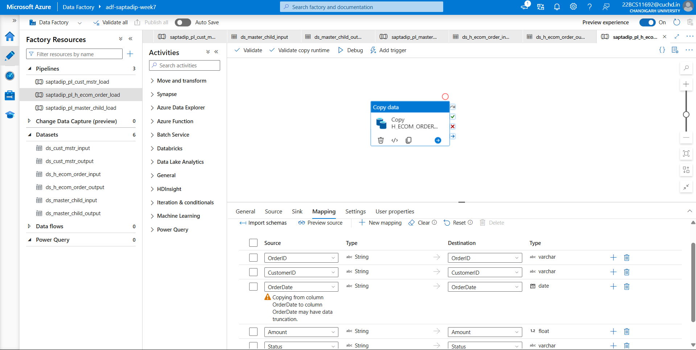 |

---

### ✅ Monitoring Successful Run

| All Pipelines Succeeded | Screenshot |
|--------------------------|------------|
| Pipeline Run Status | 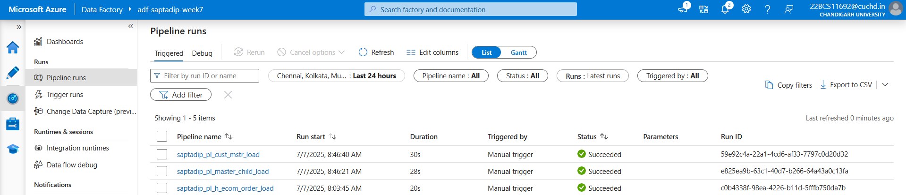 |

---

## 🗺️ Pipeline Diagrams (Visual Layouts)

| Pipeline | Diagram |
|----------|---------|
| CUST_MSTR |  |
| master_child_export | 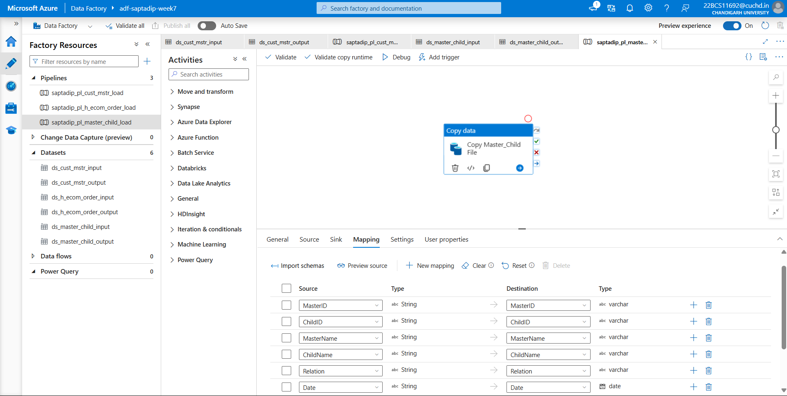 |
| H_ECOM_ORDER |  |

---

## 🛠️ Technologies Used

- **Azure Data Factory** – for building data pipelines
- **Azure Blob Storage** – for storing CSV files
- **Azure SQL Database** – for final data destination
- **Static Pipelines** – no parameters used (beginner-friendly setup)

---

## 🙋‍♂️ About Me

**👤 Saptadip Das**  
Data Engineering Intern @ Celebal Technologies  
This was part of my **Week 7 internship assignment**.

---

## ✅ How to Deploy This Project

1. Open Azure Data Factory Studio
2. Use the **Author** tab to import:
   - Linked Services (`Manage > Linked Services`)
   - Datasets (`Author > Datasets`)
   - Pipelines (`Author > Pipelines`)
3. Run each pipeline individually
4. Confirm success via **Monitor tab**
5. Check loaded data in the respective SQL tables

---

## 💬 Feedback or Questions?

Feel free to raise an issue or connect with me for collaboration or improvements.

Thanks for checking out the project! 🙏
